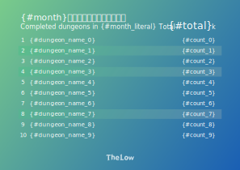
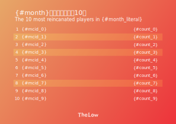

# TheLow のプレイデータ集計ツール

~~[Jaeger](https://www.jaegertracing.io/)という分散トレーシングシステムに登録されたデータを集計するツールです。~~

Elasticsearch を利用するようにしました。(2021/9/8)

集計期間の指定は月単位で行います。

毎月ランキングを発表するためにデータの取得から画像の出力までを自動化しました。

現在集計できる情報

- ダンジョン攻略回数
- プレイヤーの転生回数

今後の実装予定

- プレイヤーのプレイ時間
- 特定のプレイヤーに焦点を置いた情報の取得

## 使い方

`default.json`のファイル名を`config.json`に変更し、

`elastic -> host`の値に適切なアドレスを設定してください。

`Year`と`Month`に指定した年月からデータを集計します。

```sh
go run main.go
```

すると、`data/<year>/<name of month>/completes.json`に集計結果が出力されます。

また、コマンドライン引数から年月を指定することもできます。

```sh
go run main.go -month=4 -year=2021
```

これは 2021 年 4 月を指定した場合です。

## テンプレートから画像(SVG)を生成

```sh
go run main.go -image
```

このコマンドを実行すると、集計したデータをもとにテンプレートからランキング画像を生成します。

下の画像がテンプレートです。


